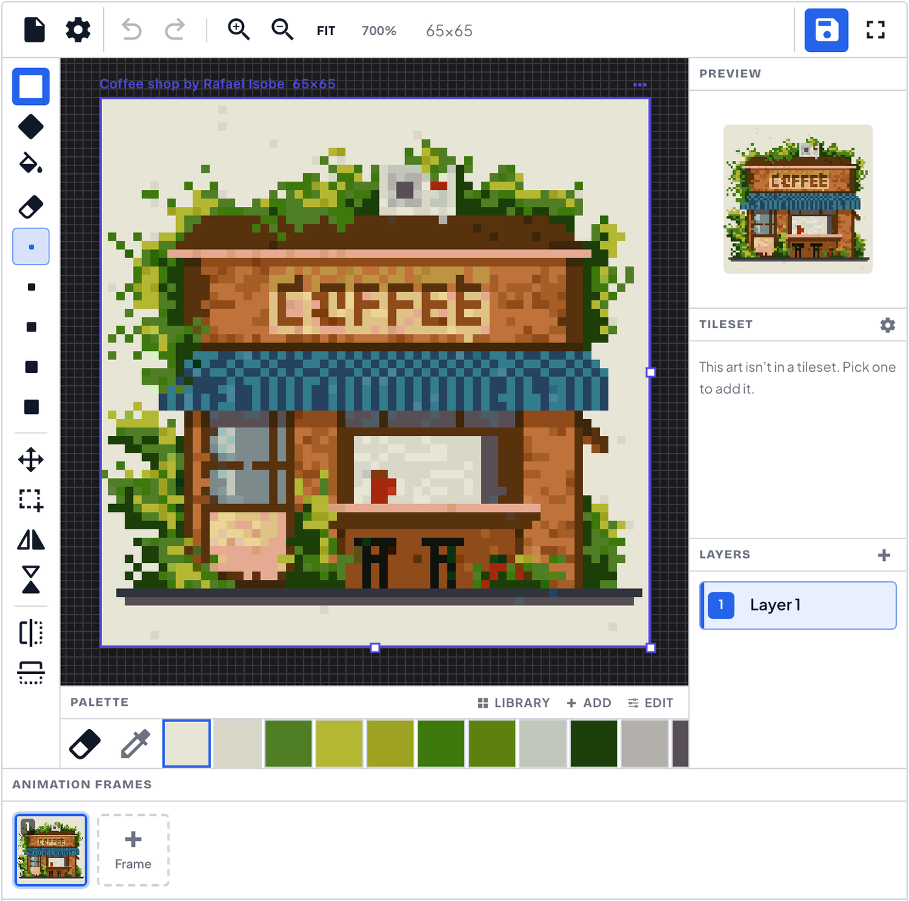

# Simple Pixel Art

Free, browser-based pixel art editor — draw sprites, build tilesets with auto-tiling terrains, paint tilemaps, animate frame-by-frame, and share to a community gallery. No install, no signup required.

**Live: [simplepixelart.com](https://simplepixelart.com)**

[](LICENSE)



## Features

- **Pixel editor** — brushes (1–5 px), fill, eraser, selections, layers, unlimited undo/redo, mirror drawing, and an infinite-canvas workspace with multiple boards
- **Animation** — frame timeline with onion skin, per-frame duration, GIF and spritesheet export
- **Isometric mode** — dimetric grid with iso-line tool for 2:1 pixel terrain
- **Tilesets** — curate tiles into groups, auto-generate Wang-16 / blob-47 terrain sets from a base tile, export Godot 4 `TileSet`, Tiled `.tsx`, or PNG + JSON
- **Tilemaps** — paint grid or isometric maps with layers, terrains, and random variants
- **Convert** — turn any image into pixel art (median-cut quantization, live adjustments, pixel cleaner)
- **Palettes** — browse/apply community palettes, extract a palette from an image, or build one from a color
- **Sprite slicer** — cut sprites out of a sheet and open them in the editor
- **Export** — PNG, SVG, JSON, GIF, spritesheet
- **Keyboard-first** — `B` brush · `E` eraser · `G` fill · `V` move · `M` select · `L` iso line · `1–5` brush size · `Space` pan · `⌘/Ctrl+Z` undo

Works fully as a guest — everything autosaves locally (localStorage + IndexedDB). Signing in adds cloud storage and publishing to the [gallery](https://simplepixelart.com/arts).

## Tech stack

- [Nuxt 4](https://nuxt.com) (Vue 3, SSR hybrid) + [Pinia](https://pinia.vuejs.org)
- Hand-rolled canvas renderer (no engine) — see `app/components/PXEditor.vue` and `app/helper/canvas.ts`
- Pure CSS design system (`app/assets/css/main.css`) — no CSS framework at runtime
- Nitro server routes for dynamic sitemaps

## Getting started

Requires [Bun](https://bun.sh) and Node 22 (see `.nvmrc`).

```bash
bun install
bun dev          # http://localhost:3000
```

Production build:

```bash
bun run build
node .output/server/index.mjs
```

### Configuration

Copy `.env.example` to `.env` if you want to override defaults:

| Variable | Default | Purpose |
|---|---|---|
| `NUXT_PUBLIC_API` | `https://touch.ninosaur.com` | Backend API base URL |
| `NUXT_PUBLIC_SITE_URL` | `https://simplepixelart.com` | Canonical URL for SEO |
| `NUXT_PUBLIC_ADS_ENABLED` | `true` | Set `false` to disable ads/analytics scripts |

### A note on the backend

This repository is the **frontend**. Community data (gallery, palettes, cloud saves, auth) comes from a hosted REST API (`touch.ninosaur.com`), which is not open source. The editor itself — drawing, animation, tilesets, conversion, exports — runs entirely in the browser and works without an account.

## Project layout

```
app/
  components/     # auto-imported; PXEditor.vue is the editor core
  pages/          # file-based routes (editor, gallery, palettes, tilesets…)
  stores/         # Pinia: editor.store.ts (canvas state), auth.store.ts
  helper/         # pure utils: canvas.ts, anim-export.ts, sheet-layout.ts…
  assets/css/     # main.css design system (icons.css is generated)
modules/          # local Nuxt module: scans icon-* classes → generates icons.css
public/icons/     # SVG icon set (mask-image, colored via currentColor)
server/routes/    # sitemap generators
scripts/          # build-pack.ts (tileset → distributable asset pack)
```

To add an icon: drop `public/icons/<name>.svg` and use `class="icon icon-<name>"` — the CSS is generated automatically.

## Contributing

Issues and PRs are welcome. Keep changes small and focused; match the existing code style (no linter is configured on purpose). For anything large, open an issue first.

## License

[MIT](LICENSE)
